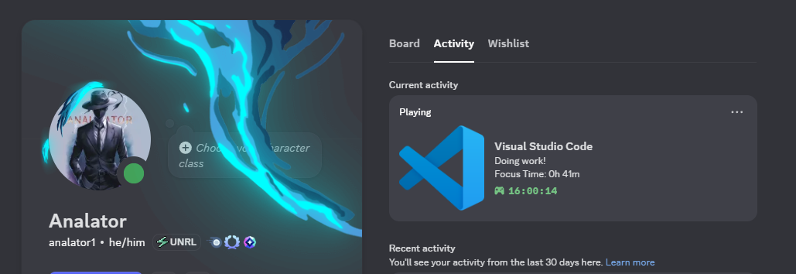
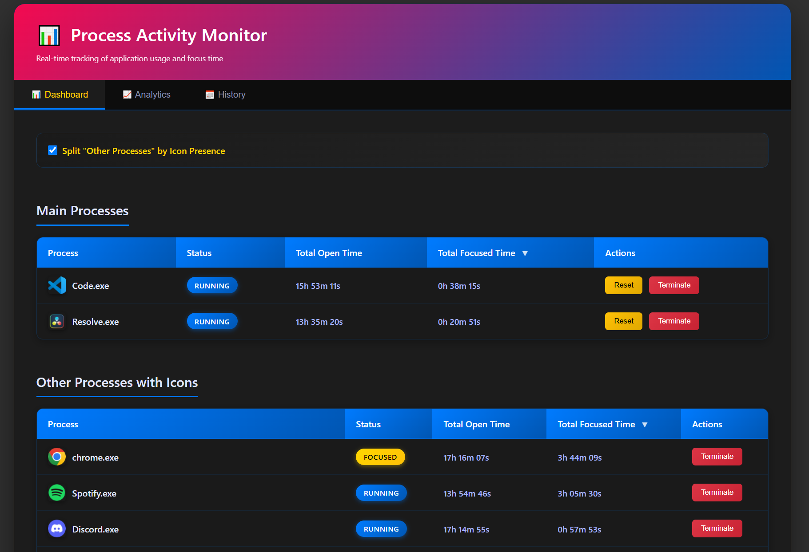
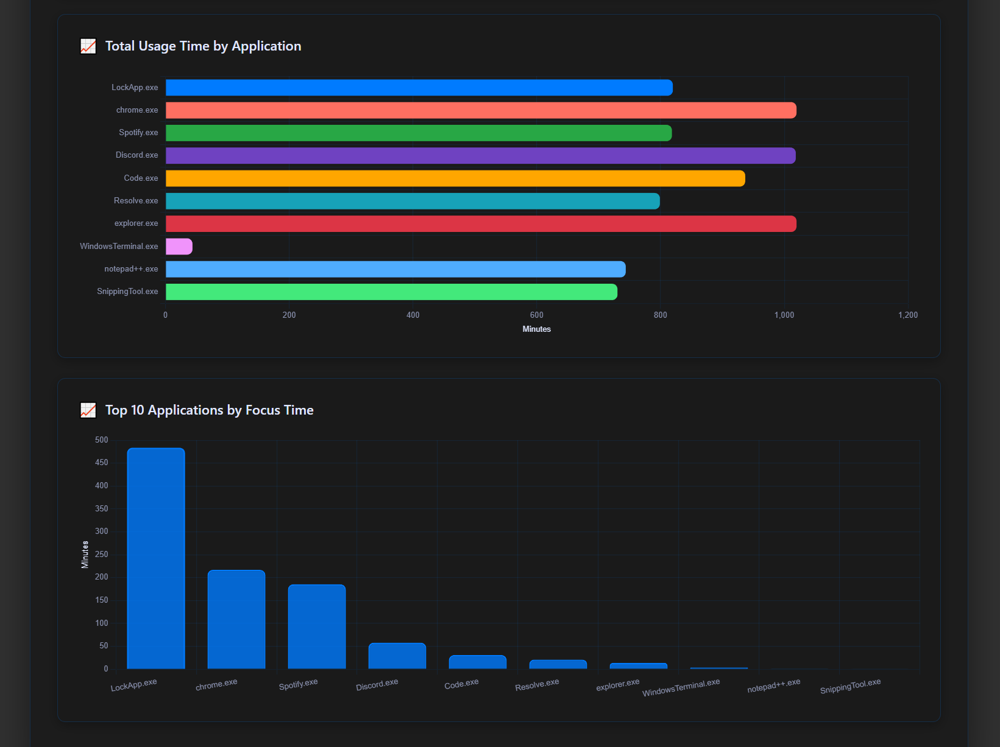
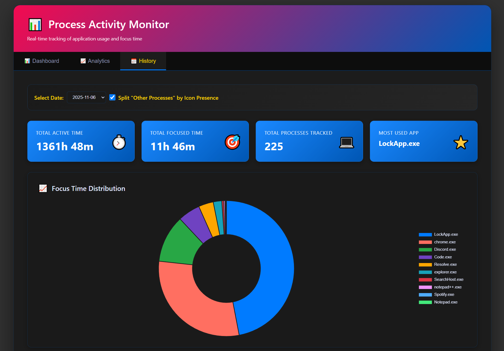

# EXE-Monitor

A real-time Windows process activity monitor with Discord Rich Presence integration and web-based dashboard.

## Features

- **Real-time Process Tracking** - Monitor running applications and their usage statistics
- **Time Tracking** - Track total open time and focused time for each application
- **Discord Rich Presence** - Display your current activity on Discord
- **Web Dashboard** - Beautiful, responsive web interface with live updates
- **Analytics** - Visualize your usage patterns with interactive charts
- **Historical Data** - View past activity with persistent daily logs
- **Focus Detection** - Automatically detects when an application has focus

## Screenshots









The dashboard provides three main views:
- **Dashboard**: Real-time process monitoring with status indicators
- **Analytics**: Visual charts showing usage patterns and statistics
- **History**: Browse historical data from previous days

## Requirements

- Windows
- Python 3.7+
- Discord (optional, for Rich Presence feature)

## Installation

1. Clone the repository:
```bash
git clone https://github.com/Analator1/Exe-Monitor.git
cd Exe-Monitor
```

2. Install dependencies:
```bash
pip install -r requirements.txt
```

3. Configure your applications in `Exe-Monitor.py`:
```python
MAIN_PROCESS_CLIENT_IDS = {
    "YourApp.exe": "your_discord_client_id",
    "AnotherApp.exe": "another_discord_client_id",
}
```

## Getting Discord Client IDs

To enable Discord Rich Presence for your applications:

1. Go to the [Discord Developer Portal](https://discord.com/developers/applications)
2. Click "New Application" and give it a name (e.g., "DaVinci Resolve") and modify it however you like
3. Once created, copy the "Application ID" from the General Information page
4. Use the Application ID in the `MAIN_PROCESS_CLIENT_IDS` dictionary
5. Repeat for each application you want to track

Example:
```python
MAIN_PROCESS_CLIENT_IDS = {
    "Resolve.exe": "1234567890123456789",
    "Code.exe": "9876543210987654321",
}
```

Note: Each application needs its own Discord Application ID for Rich Presence to work.

## Usage

1. Run the script:
```bash
python Exe-Monitor.py
```

2. Open your browser to `http://localhost:1111`

3. The monitor will automatically track your applications and update Discord Rich Presence

## Configuration

- `POLL_INTERVAL`: How often to check process status (default: 1.0 seconds)
- `WEB_SERVER_PORT`: Web dashboard port (default: 1111)
- `SAVE_INTERVAL`: How often to save data (default: 5 seconds)
- `DISCORD_UPDATE_INTERVAL`: How often to update Discord RPC (default: 15 seconds)

## Data Storage

Activity data is automatically saved to:
```
%APPDATA%\EXE-Monitor\YYYY-MM-DD.json
```

## Features

### Dashboard View
- Color-coded status indicators (Focused/Running/Closed)
- Real-time timer updates
- Process termination controls
- Timer reset functionality
- Icon extraction from executables
- Sortable tables

### Analytics View
- Total active time and focused time statistics
- Focus time distribution (doughnut chart)
- Total usage time by application (horizontal bar chart)
- Top 10 applications by focus time

### History View
- Browse historical data by date
- Same analytics charts for past days
- Compare usage patterns over time

## License

MIT License - feel free to modify and use as needed

## Contributing

Pull requests are welcome! For major changes, please open an issue first to discuss what you would like to change.

## Troubleshooting

- **Discord RPC not working**: Ensure Discord is running and the Client ID is correct
- **Process icons not showing**: Some system processes may not have extractable icons
- **Port already in use**: Change `WEB_SERVER_PORT` in the script